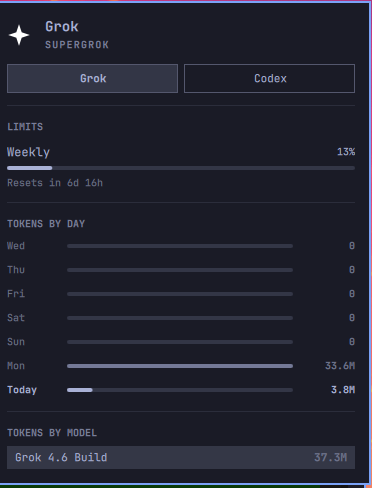

# Grok Usage



Grok on the Omarchy agents panel. Opens on your default coding agent.

**ID:** `calmasacow.grok-usage`  
**Author:** James Barnette  
**License:** MIT  
**Version:** 0.3.2

Stock Omarchy already shows Claude, Codex, and Fireworks on the robot-head
Agents widget. This plugin is that same panel (the bar icon stays the robot
head), plus:

- the **Grok mark** in the Grok tab (not the star that shipped in 0.2)
- a **weekly SuperGrok meter** that matches grok.com: percent used, reset
  timestamp, and Grok Build vs Chat segments
- **today's token count**, remaining percent in the header, and shortcuts to
  Add Credits / Console / Docs at the bottom of the Grok tab
- **Details** always open (sessions, cache hit, top models) — the daily
  token chart is gone; today's usage is a token stat instead
- a **Grok** collector (SuperGrok weekly pool, plan name, local session stats)
- the panel **opens on your default coding agent** (`omarchy default agent`)
  instead of the first id alphabetically

Enabling it replaces `omarchy.agents` in the bar. Removing it puts the stock
widget back.

Unofficial. Not affiliated with xAI or Omarchy.

## Install

Grok Build must already be signed in (`grok login`).

```sh
omarchy plugin add https://github.com/calmasacow/omarchy-grok-usage.git --enable
```

Left-click the robot head. The Grok chip should be selected if your default
agent is `grok`.

## Usage

| Control | Action |
|---|---|
| Left-click | Open / close the usage panel |
| Right-click | Launch the default coding agent |
| Middle-click | Next subscription |
| `h` / `l` | Switch subscription |
| `r` or Enter | Refresh |
| Esc | Close |

## Remove

```sh
omarchy plugin remove calmasacow.grok-usage
```

If you previously installed the collector-only script (0.1), stop the watcher too:

```sh
systemctl --user disable --now omarchy-agent-usage-grok.service
rm -f ~/.config/systemd/user/omarchy-agent-usage-grok.service
rm -f ~/.config/omarchy/agents/omarchy-agent-usage-grok
rm -f ~/.config/omarchy/agents/omarchy-agent-usage-grok-watch
rm -f ~/.config/omarchy/hooks/post-boot.d/start-grok-usage-collector.hook
```

## How it works

The stock panel only *displays* JSON in `~/.local/state/omarchy/agents/usage/`.
Packaged `omarchy-agent-usage-update` scans `$OMARCHY_PATH/bin`, so Grok cannot
live there. This plugin runs `scripts/omarchy-agent-usage-grok` after each
refresh and writes `grok.json`.

The collector reads the login already in `~/.grok/auth.json` and asks the same
CLI-proxy billing endpoints Grok Build uses for `/usage`. Authenticated
requests stay on `cli-chat-proxy.grok.com` and refuse cross-origin redirects
so the Grok token is not forwarded. Usage files are opened as regular files
with a size cap (`O_NOFOLLOW`); QML never FileView-reads them. No tokens are
stored in this repository.

| File | Role |
|---|---|
| `Panel.qml` | Bar icon + usage dashboard |
| `Main.qml` | Discover records, refresh collectors, prefer default agent |
| `scripts/omarchy-agent-usage-grok` | Session scan + SuperGrok billing probe |

## Requirements

- [Omarchy](https://omarchy.org/)
- Grok Build signed in (`grok login`)
- `python3`

## License

MIT. Panel QML is adapted from Omarchy's first-party Agents plugin.
